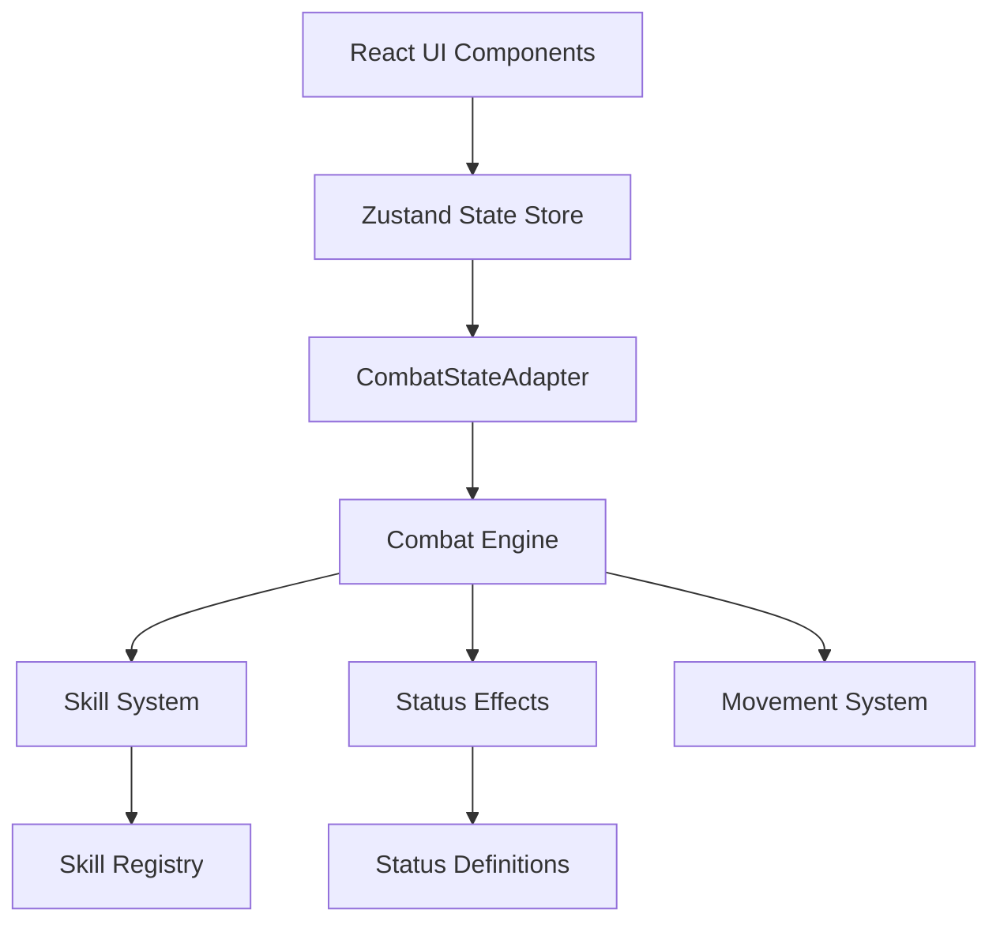
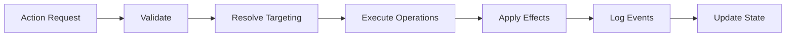
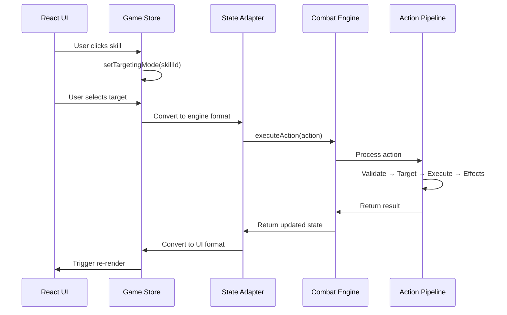
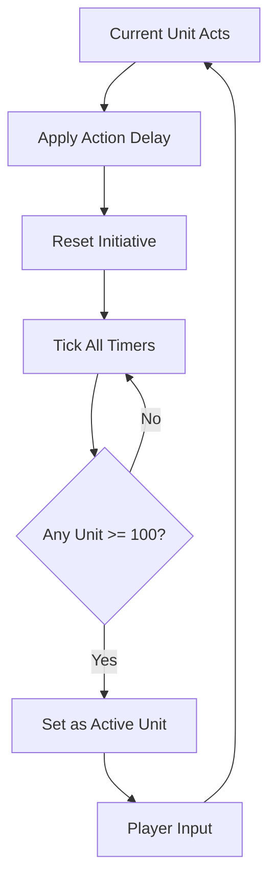

# System Architecture

## Overview

Gridlock's Combat System v3.0 is a modular, extensible tactical combat engine built with TypeScript and React. The system follows a clean separation between the combat engine logic and UI presentation layer, connected through a state adapter pattern.



## Module Structure

```
src/
├── combat/                 # Combat system modules
│   ├── engine/            # Core combat engine
│   │   ├── CombatEngine.ts        # Main combat controller
│   │   └── ActionPipeline.ts      # Action execution pipeline
│   ├── skills/            # Skill definitions & registry
│   │   └── SkillRegistry.ts       # All skill definitions
│   ├── effects/           # Status effect system
│   │   └── StatusRegistry.ts      # Status effect definitions
│   ├── adapter/           # State conversion layer
│   │   └── CombatStateAdapter.ts  # UI ↔ Engine bridge
│   ├── movement/          # Movement pattern system
│   │   └── MovementPatterns.ts    # Chess-like movement
│   ├── math/              # Combat calculations
│   │   └── DamageCalculator.ts    # Damage formulas
│   └── types.ts           # Core type definitions
├── components/            # React UI components
│   ├── Board.tsx          # Game board display
│   ├── SkillBar.tsx       # Skill interface
│   ├── UnitInfoPanel.tsx  # Unit information
│   └── InitiativeTrack.tsx # Turn order display
├── store/                 # State management
│   └── gameStore.ts       # Zustand game state
└── types/                 # Legacy UI types
    └── index.ts
```

## Core Systems

### Combat Engine

The `CombatEngine` is the central controller that manages all combat logic.

**Key Responsibilities:**
- Turn management and initiative system
- Action validation and execution
- Combat state updates
- Event logging

**Main Components:**

#### CombatEngine.ts
```typescript
class CombatEngine {
    // Initialize combat state
    initializeCombat(units: Unit[]): CombatState
    
    // Execute a combat action (skill use, movement)
    executeAction(action: CombatAction): CombatResult
    
    // Advance to next unit's turn
    advanceTurn(): void
    
    // Get current combat state snapshot
    getState(): CombatSnapshot
}
```

#### ActionPipeline.ts
Processes combat actions through a series of stages:
1. **Validation** - Check if action is legal
2. **Targeting** - Determine affected units/tiles
3. **Execution** - Apply skill operations
4. **Effects** - Trigger status effects
5. **Logging** - Record combat events



---

### Skill System

The skill system is declarative and operation-based, allowing complex abilities to be composed from simple operations.

#### Skill Structure

```typescript
interface Skill {
    id: string;
    name: string;
    description: string;
    cost: number;              // Action Point cost
    cooldown: number;          // Turns until reusable
    targeting: TargetingInfo;  // Who/what can be targeted
    ops: SkillOp[];           // Ordered operations
    tags?: string[];          // Categories (offensive, support, etc.)
    actionDelay?: number;     // Initiative penalty
    quickcast?: boolean;      // Reduced initiative cost
}
```

#### SkillOp Types

Skills are built from composable operations:

| Operation Type | Purpose | Example |
|---------------|---------|---------|
| `DamageOp` | Deal damage | Basic attack, spell damage |
| `HealOp` | Restore HP | Heal spell, regeneration |
| `ApplyStatusOp` | Apply status effect | Stun, burn, buff |
| `CleanseOp` | Remove statuses | Dispel, cure |
| `MoveOp` | Movement | Dash, teleport, leap |
| `AoEOp` | Area targeting | Fireball, nova |
| `ChainOp` | Multi-target | Chain lightning |
| `PushOp`/`PullOp` | Displacement | Knockback, pull |
| `ShieldOp` | Grant shield | Barrier, protect |

#### Example: Fireball Skill

```typescript
fireball: {
    id: 'fireball',
    name: 'Fireball',
    description: 'Launch a ball of fire that explodes on impact',
    cost: 2,
    cooldown: 3,
    targeting: {
        type: 'aoe',
        range: 5,
        radius: 1,
        filter: 'any'
    },
    ops: [
        { type: 'aoe', radius: 1, center: 'target' },
        { type: 'damage', power: 1.2, damageType: 'fire' },
        { type: 'applyStatus', statusId: 'burn', duration: 2, stacks: 1, value: 10 }
    ],
    tags: ['offensive', 'ranged', 'aoe', 'fire'],
    actionDelay: 10
}
```

This single declaration creates a skill that:
1. Targets an area 5 tiles away
2. Affects all units in 1-tile radius
3. Deals fire damage
4. Applies burn status

---

### Initiative System

Gridlock uses a **Final Fantasy Tactics-style initiative system** where units act based on an initiative timer that fills over time.

#### Core Mechanics

```typescript
interface UnitRuntime {
    initiative: number;        // Current timer value (0-100)
    speed: number;            // Fill rate per tick
    actionPoints: number;     // Available AP
    hasActed: boolean;        // Acted this turn?
}
```

**Turn Flow:**
1. All unit initiative timers increment by their speed
2. When a unit reaches 100 initiative, they can act
3. After acting, initiative resets to 0 (minus any action delay)
4. Cycle continues

**Action Delays:**
- Each skill can specify `actionDelay` 
- Heavier skills add more delay after use
- Quickcast skills reduce delay
- Stun/Freeze stops initiative timer

#### Speed Calculation

```typescript
baseSpeed = unit.stats.spd
modifiedSpeed = baseSpeed * (1 + speedModifiers)

// Example modifiers:
// - Haste: +50% speed
// - Slow: -50% speed
// - Frozen: Timer freeze (0 speed)
```

---

### Status Effect Framework

Status effects are data-driven with event-based triggers.

#### StatusDefinition Structure

```typescript
interface StatusDefinition {
    id: string;
    name: string;
    type: 'buff' | 'debuff' | 'control' | 'aura';
    
    // Stacking rules
    isStackable: boolean;
    maxStacks?: number;
    isDurationStackable?: boolean;
    
    // Exclusivity
    isExclusiveWith?: string[];
    
    // Aura properties
    isAura?: boolean;
    auraRadius?: number;
    
    // Event hooks
    onApply?: (unit: Unit, instance: StatusInstance) => void;
    onTick?: (unit: Unit, instance: StatusInstance) => void;
    onRemove?: (unit: Unit, instance: StatusInstance) => void;
    onHit?: (unit: Unit, instance: StatusInstance, target: Unit) => void;
    
    // Stat modifiers
    statModifiers?: Partial<BaseStats>;
    resistanceModifiers?: Partial<ElementalResistances>;
    initiativeModifier?: number;
}
```

#### Example: Burn Status

```typescript
burn: {
    id: 'burn',
    name: 'Burning',
    type: 'debuff',
    isStackable: true,
    maxStacks: 5,
    
    onTick: (unit, instance) => {
        const damage = instance.value || 10;
        unit.stats.hp -= damage * instance.stacks;
    },
    
    onApply: (unit, instance) => {
        // Visual effects, logging
    }
}
```

**Common Status Effects:**
- **Stun** - Cannot act, initiative frozen
- **Burn** - Damage over time (DoT)
- **Freeze** - Initiative frozen, increased damage taken
- **Shield** - Absorbs damage
- **Haste** - Increased initiative speed
- **Slow** - Decreased initiative speed

---

### Damage Calculation System

Located in `combat/math/DamageCalculator.ts`, handles all combat math.

#### Base Damage Formula

```typescript
baseDamage = skill.power * attacker.stats.atk
```

#### Damage Modifiers

1. **Defense Reduction**
   ```typescript
   reduction = defender.stats.def / (defender.stats.def + 100)
   damageAfterDef = baseDamage * (1 - reduction)
   ```

2. **Penetration**
   ```typescript
   effectiveDef = def * (1 - penetration)
   ```

3. **Elemental Resistance**
   ```typescript
   damageAfterRes = damage * (1 - resistance)
   ```

4. **Critical Hits**
   ```typescript
   if (random() < critChance) {
       damage *= critMultiplier
   }
   ```

5. **Conditional Modifiers**
   - Bonus vs Stunned targets
   - Flanking bonus
   - Low HP execution bonus
   - Distance scaling

#### Final Damage Application

```typescript
finalDamage = Math.floor(
    baseDamage 
    * defenseReduction
    * resistanceReduction
    * critMultiplier
    * conditionalModifiers
)
```

---

### State Management

#### CombatStateAdapter

Bridges the gap between legacy UI state and new combat engine state.

**Key Functions:**

```typescript
// Convert UI unit to engine format
toEngineUnit(rawUnit: any): Unit

// Convert engine unit back to UI format  
toLegacyUnit(engineUnit: Unit): any

// Convert full combat state
adaptCombatState(state: any): CombatState
```

**Why Needed:**
- UI uses legacy format (flat stats, simple structure)
- Engine uses comprehensive format (nested stats, runtime state)
- Adapter allows gradual migration

#### Zustand Game Store

Central state management using Zustand:

```typescript
interface ExtendedGameState {
    // Board state
    grid: Cell[][];
    
    // Unit state
    units: Unit[];
    selectedUnitId: string | null;
    
    // Turn state
    turn: Player;
    turnOrder: string[];
    activeUnitId: string | null;
    
    // Skill state
    targetingSkillId: string | null;
    
    // Actions
    selectUnit: (id: string) => void;
    moveUnit: (id: string, pos: Position) => void;
    setTargetingMode: (skillId: string | null) => void;
    endTurn: () => void;
}
```

---

### Movement System

Located in `combat/movement/MovementPatterns.ts`.

Provides chess-like movement patterns with support for both `pos` and `position` properties (backward compatibility).

#### Pattern Functions

```typescript
// Knight: L-shape movement
getKnightPattern(unit: Unit, grid: Cell[][]): Position[]

// Bishop: Diagonal lines
getBishopPattern(unit: Unit, grid: Cell[][]): Position[]

// Rook: Straight lines
getRookPattern(unit: Unit, grid: Cell[][]): Position[]

// Queen: Rook + Bishop
getQueenPattern(unit: Unit, grid: Cell[][]): Position[]

// King: 1 tile any direction
getKingPattern(unit: Unit, grid: Cell[][]): Position[]
```

#### Custom Patterns

Units can have custom movement defined by their type or skills.

---

## Data Flow

### Action Execution Flow



### Turn Advancement Flow



---

## Performance Considerations

### Optimization Strategies

1. **Immutable State Updates**
   - Use structural sharing for state updates
   - Minimize re-renders with React.memo

2. **Lazy Evaluation**
   - Calculate movement patterns only when needed
   - Cache status effect calculations

3. **Event Batching**
   - Batch combat log events
   - Combine state updates

4. **Memory Management**
   - Limit combat history depth
   - Clean up expired status effects

---

## Extension Points

The architecture supports easy extension:

### Adding New Skills
1. Define skill in `SkillRegistry.ts`
2. Use existing SkillOp types
3. Register in unit's skill list

### Adding New Status Effects
1. Create `StatusDefinition` in `StatusRegistry.ts`
2. Implement event hooks
3. Reference by ID in skills

### Adding New Unit Types
1. Add to `UnitType` enum
2. Define stats and skills
3. Add to unit roster

### Custom Movement Patterns
1. Create pattern function in `MovementPatterns.ts`
2. Register with unit type
3. Return valid Position[] array

---

## Testing Strategy

### Unit Tests
- Damage calculations
- Status effect logic
- Movement pattern generation
- Skill operation execution

### Integration Tests
- Full turn simulation
- Action pipeline flow
- State conversion accuracy

### Manual Testing
- Play through combat scenarios
- Verify UI responsiveness
- Check balance and feel

---

## Future Roadmap

### Planned Features
- [ ] Networked multiplayer
- [ ] AI opponent (minimax with heuristics)
- [ ] Replay system
- [ ] Combat analytics
- [ ] Advanced terrain types
- [ ] Formation system
- [ ] Unit progression/leveling

### Technical Debt
- [ ] Complete migration from legacy UI types
- [ ] Comprehensive test coverage
- [ ] Performance profiling
- [ ] Documentation automation

---

## Related Documentation

- [Skill Creation Guide](./SKILL_CREATION_GUIDE.md)
- [Status Effects Guide](./STATUS_EFFECTS_GUIDE.md)
- [API Reference](./API_REFERENCE.md)
- [Developer Setup](./DEVELOPER_SETUP.md)
